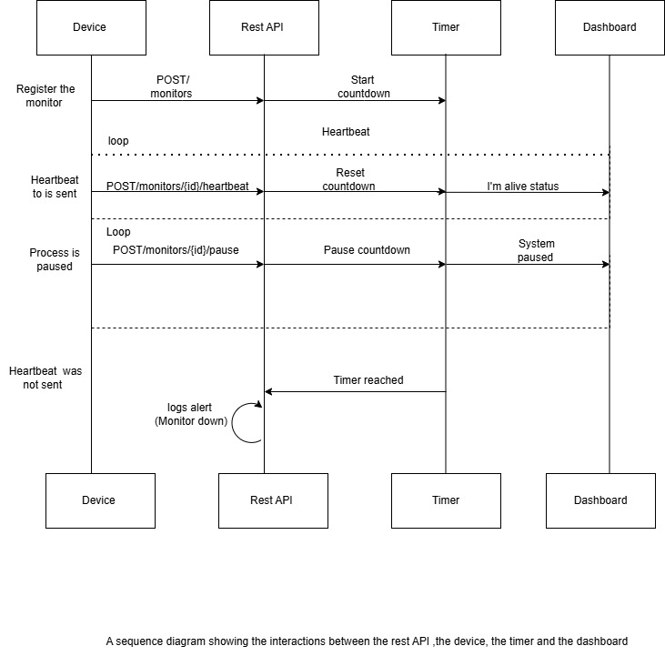

# **Watchdog Sentinel**
Below is the architecture of the Watchdog that shows its behaviour, from registering the device to sending the alert and other scenarios 

# Technologies involved
1.Python
2.Rest API

# Setup instruction 
Clone the repository 
git clone ###url 

Move to the watchdog python 
cd watchdog.py

Install Dependencies
pip install flask 

Run the appliaction 
python watchdog.py, 
for  linux: python3 watchdog.py
Server : http://127.0.0.1:5000

# API Documentation 

# Register Monitor
Endpoint

POST /monitors
Request Body
{
  "id": "device-123",
  "timeout": 60,
  "alert_email": "admin@critmon.com"
}
Success Response
{
  "message": "Monitor created",
  "device": "device-123"
}
Status Code:

201 Created

# Heartbeat

Endpoint

POST /monitors/<device_id>/heartbeat

Success Response
{
  "message": "Heartbeat received",
  "device": "device-123"
}

Status Code:

200 

# Pause Monitor

Endpoint

POST /monitors/<device_id>/pause

Success Response
{
  "message": "Monitoring paused",
  "device": "device-123"
}

Status Code:

200 
# Alert Behaviour 
{ "ALERT": "Device device-123 is down!", "time": 1751065402.87 }

# Developer's Choice: Monitor Count Endpoint

Returns the number of monitors registered. This helps us know the number of devices being monitored, without having to indivdually check

GET/monitors

Submit your repo link via the [online](https://forms.office.com/e/rGKtfeZCsH) form.

## 🛑 Pre-Submission Checklist
**WARNING:** Before you submit your solution, you **MUST** pass every item on this list.
If you miss any of these critical steps, your submission will be **automatically rejected** and you will **NOT** be invited to an interview.

### 1. 📂 Repository & Code
- [ ] **Public Access:** Is your GitHub repository set to **Public**? (We cannot review private repos).
- [ ] **Clean Code:** Did you remove unnecessary files (like `node_modules`, `.env` with real keys, or `.DS_Store`)?
- [ ] **Run Check:** if we clone your repo and run `npm start` (or equivalent), does the server start immediately without crashing?

### 2. 📄 Documentation (Crucial)
- [ ] **Architecture Diagram:** Did you include a visual Diagram (Flowchart or Sequence Diagram) in the README?
- [ ] **README Swap:** Did you **DELETE** the original instructions (the problem brief) from this file and replace it with your own documentation?
- [ ] **API Docs:** Is there a clear list of Endpoints and Example Requests in the README?

### 3. 🧹 Git Hygiene
- [ ] **Commit History:** Does your repo have multiple commits with meaningful messages? (A single "Initial Commit" is a red flag).

---
**Ready?**
If you checked all the boxes above, submit your repository link in the application form. Good luck! 🚀
